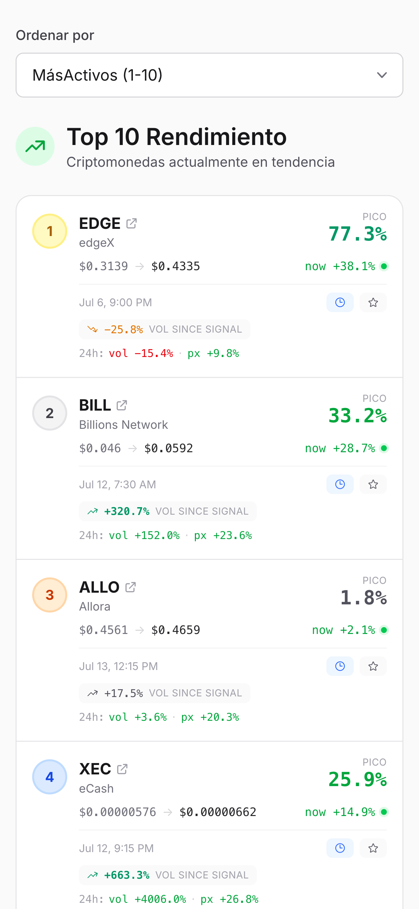
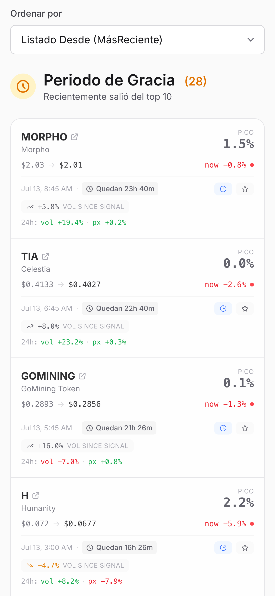
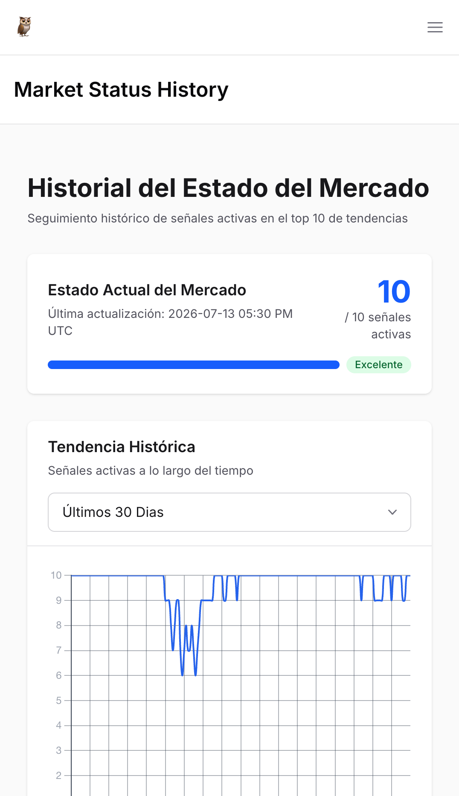
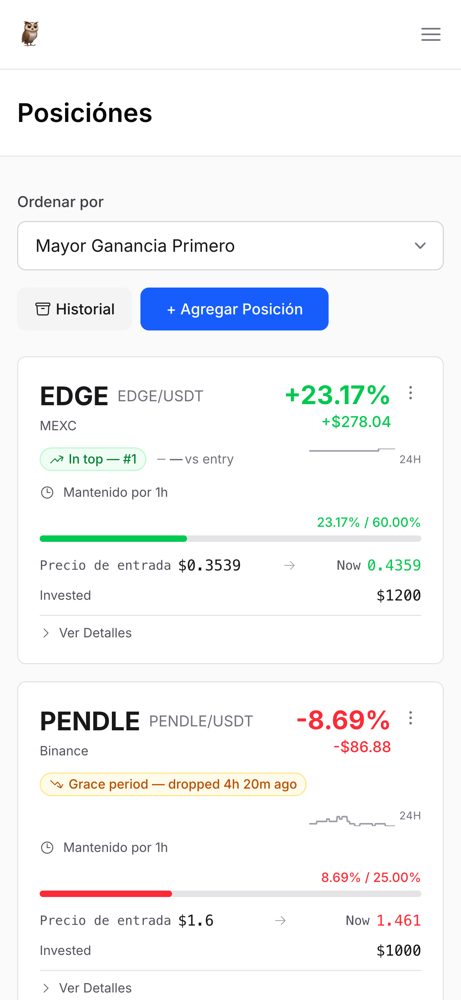
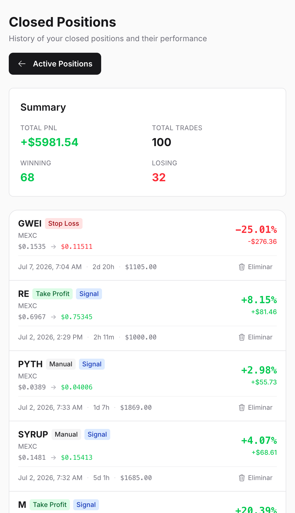
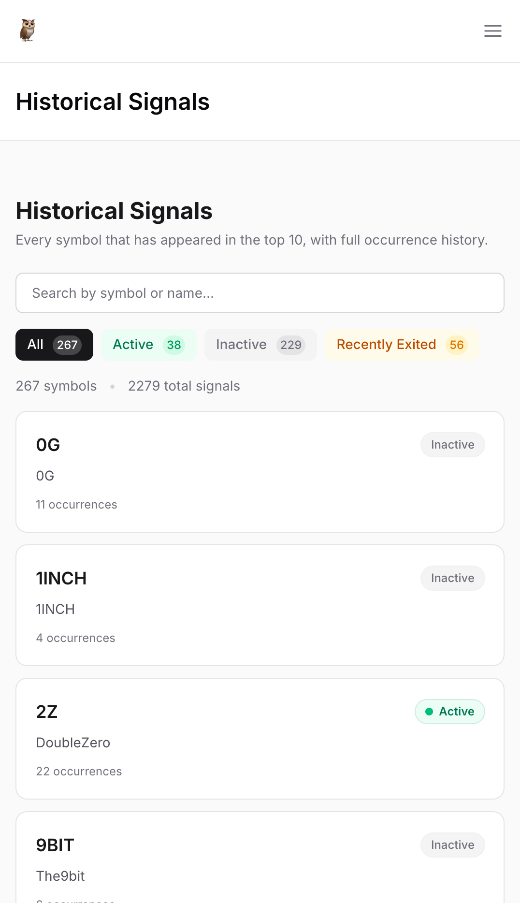
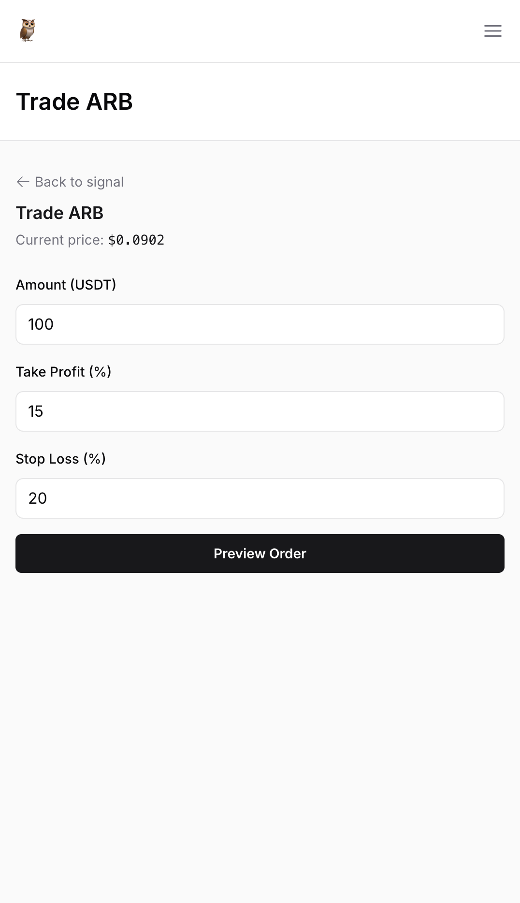

# CoinTracker

> [!TIP]
> **Apoya el proyecto — y consigue un mes gratis.** CoinTracker es gratuito y de
> código abierto, pero la app necesita una API key de
> [CoinScanX](https://coinscanx.com/?ref=WMG2XT) para obtener señales, así que
> necesitarás una cuenta de CoinScanX de todos modos. Regístrate con este
> **enlace de referido** y obtienes **un mes gratis** — el maintainer también.
> Una forma de coste cero de agradecer el lanzamiento open-source.

> **Documentación:** [English](README.en.md) · **Español**

**Sabes cuándo comprar. Sabes cuándo vender.** CoinTracker revela señales
cripto on-chain, sigue tus posiciones y te avisa por Telegram cuando es momento
de actuar — para que operes con convicción en lugar de FOMO.

> **No es asesoría financiera.** CoinTracker es una herramienta de código
> abierto que agrega y muestra datos on-chain e indicadores de mercado. Nada
> aquí constituye asesoría de inversión. Haz tu propia investigación; tú eres
> responsable de tus propias operaciones.

---

## Galería

### Homepage — Top 10 señales


### Homepage — Período de gracia


### Estado del mercado


### Posiciones


### P&L de posiciones


### Señales históricas


### Orden OCO en Binance


---

## Funciones

- **Señales on-chain** — configuraciones de alta probabilidad derivadas de datos
  de blockchain e indicadores de mercado, ingeridas desde
  [CoinScanX](https://coinscanx.com/?ref=WMG2XT).
- **Seguimiento de posiciones** — registra entradas, objetivos y stop-losses;
  ve el P&L de un vistazo en posiciones abiertas y cerradas.
- **Alertas de Telegram** — recibe notificaciones al momento cuando una moneda
  muestra actividad alcista, o cuando tus posiciones alcanzan
  umbrales/stop-loss. También cambios de estado del mercado.
- **Estado del mercado** — una vista continua de si el mercado está alcista,
  bajista o lateral, con un gráfico de 30 días para sincronizar tu estrategia.
- **Señales históricas** — explora cada señal que se haya llamado, con precios
  de entrada/pico/salida. El historial es público, sin necesidad de registro.
- **Integración con exchange** — guarda tus claves API de Binance (cifradas en
  reposo con [Cloak](https://github.com/danielberkompas/cloak)) para habilitar
  trading con un clic desde una señal.
- **Panel de administración** — tablero impulsado por
  [Backpex](https://backpex.live) para gestionar usuarios, posiciones y señales.

## Stack técnico

[Elixir](https://elixir-lang.org) 1.15+ · [Phoenix](https://phoenixframework.org)
1.8 · [LiveView](https://hexdocs.pm/phoenix_live_view) ·
[Ecto](https://hexdocs.pm/ecto) / PostgreSQL ·
[Tailwind CSS](https://tailwindcss.com) + [daisyUI](https://daisyui.com) ·
[Req](https://hexdocs.pm/req) (HTTP) · [ex_gram](https://hexdocs.pm/ex_gram)
(Telegram) · [Swoosh](https://hexdocs.pm/swoosh) + [Resend](https://resend.com)
(correo) · servidor web [Bandit](https://github.com/mtrikel/bandit).

## Requisitos previos

- **Elixir 1.15+** (verificado en 1.19.5 / OTP 28) y **Erlang/OTP** — verifica
  con `elixir --version`
- **PostgreSQL 15+** — lo más fácil vía Docker (ver Inicio rápido)
- **Node.js 18+** (verificado en v22) y npm (para deps de activos JS como
  Chart.js)
- **Mix** (incluido con Elixir)

## Inicio rápido

```bash
# 1. Clona y entra al repo
git clone <url-de-tu-fork> coin_tracker
cd coin_tracker

# 2. Inicia una instancia de Postgres (dev en :5432, test en :5433)
docker compose up -d

# 3. Copia la plantilla de entorno y genera los dos secretos criptográficos
cp .env.example .env
mix phx.gen.secret            # -> pégalo en SECRET_KEY_BASE
mix phx.gen.secret 32         # -> pégalo en LIVE_VIEW_SIGNING_SALT

# 4. Carga el env en tu shell (haz esto en cada nueva terminal)
set -a; source .env; set +a

# 5. Instala deps, deps JS, crea + migra la BD, construye activos
mix setup

# 6. Arranca el servidor
mix phx.server
```

Ahora visita **http://localhost:4000**. Deberías ver la página de inicio. Haz
clic en **Comenzar** para registrar una cuenta y empezar a seguir posiciones.

> El alias `mix setup` ejecuta `deps.get`, `npm install` (en `assets/`),
> `ecto.setup` (crear + migrar + sembrar) y `assets.setup`/`assets.build`. Las
> semillas pueblan 30 días de datos sintéticos de estado del mercado para que
> el gráfico no esté vacío.

### ¿No tienes Docker?

Cualquier instancia de PostgreSQL 15+ funciona. La configuración de dev
(`config/dev.exs`) se conecta a
`postgres:postgres@localhost:5432/coin_tracker_dev`, y test usa
`localhost:5433/coin_tracker_test`. Apunta esos a tu propio servidor, o anula
`DATABASE_URL` en `.env` y ajusta `config/dev.exs` según corresponda.

## Recorrido para nuevos usuarios

La experiencia de primer uso tiene algunos pasos no obvios. Esto es lo que
esperar, verificado conduciendo la app con automatización de navegador en una
instalación limpia.

### 1. El registro es sin contraseña (magic link)

El formulario de registro en `/users/register` pide **solo el correo** — sin
contraseña. Tras hacer clic en **Crear una cuenta**, se te redirige a la página
de inicio de sesión y se envía un correo de confirmación. En desarrollo, Swoosh
usa el adaptador de buzón local en lugar de un servidor SMTP real, así que
recoges el correo en
**http://localhost:4000/dev/mailbox**. Abre el correo de confirmación, haz clic
en el magic link dentro, luego presiona **Confirmar y mantener la sesión
iniciada**. Ahora estás autenticado y redirigido a `/upgrade`.

### 2. La mayoría de funciones están tras una barrera de nivel Pro

Tras registrarte empiezas en el plan **gratuito**. El router protege las dos
funciones principales detrás de `require_pro_subscription`:

| Ruta | Acceso | Qué ves |
|------|--------|---------|
| `/signals`, `/signals/:id` | **Solo Pro** | Redirige a `/upgrade` |
| `/market-status` | **Solo Pro** | Redirige a `/upgrade` |
| `/admin`, `/admin/users`, `/admin/positions`, `/admin/signals` | **Solo Admin** (panel Backpex) | Gestiona usuarios, posiciones, señales; cambia niveles de suscripción |
| `/positions`, `/positions/new` | Gratuito (auth requerida) | Seguimiento de posiciones abiertas/cerradas |
| `/historical`, `/historical/:symbol` | Gratuito (público) | Cada señal que se haya llamado |
| `/tutorial` | Gratuito (auth requerida) | Guía paso a paso de inicio |
| `/users/settings`, `/settings/exchange-keys` | Gratuito (auth requerida) | Gestión de cuenta + claves API de Binance |
| `/upgrade` | Gratuito (público) | Página de precios (gratuito) / estado de suscripción (pro) |

### 3. Activar Pro para desarrollo local

El sistema de pagos USDT TRC-20 que originalmente actualizaba a los usuarios se
eliminó para este lanzamiento público, así que **no hay ruta de pago
autoservicio en la UI**. Dos formas de desbloquear `/signals` y
`/market-status` localmente:

**Opción A — ascéndete vía el panel de administración (recomendado tras
sembrar).** El primer admin debe ser ascendido a mano (ver Opción B), pero
después el panel admin de Backpex en `/admin/users` permite a un admin cambiar
el **nivel de suscripción** (Gratis/Pro/Admin) y **Subscription Expires At** de
cualquier usuario directamente desde la UI — sin código.

**Opción B — asciende al primer usuario a mano (Elixir eval).** Arranca el
primer admin desde un eval `iex`/`mix run`, luego usa el panel admin para los
demás:

```bash
set -a; source .env; set +a
mix run -e '
  user = CoinTracker.Repo.get_by!(CoinTracker.Accounts.User, email: "you@example.com")
  {:ok, user} = CoinTracker.Accounts.activate_admin_subscription(user)
  IO.puts("Activated #{user.subscription_tier} for #{user.email}")
'
```

Para un ascenso Pro no-admin desde código, usa
`Accounts.activate_pro_subscription(user, expires_at)` en su lugar. Los
operadores de forks que conecten un proveedor de pagos real deberían llamarlo
desde su handler de checkout — la lógica de barrera no cambia y está lista para
recibir una nueva fuente de pagos. Ver `docs/contexts.md` para detalles.

### 4. Las claves del proveedor de datos son obligatorias para las señales

Incluso con Pro activo, `/signals` estará **vacía** sin un
`COINSCANX_API_KEY` válido. El poller registra `Coinscan API request failed
with status 401` en cada fetch y omite la ingesta. Puedes verificar que una
clave sea válida antes de conectarla:

```bash
curl -s -o /dev/null -w "%{http_code}\n" \
  -H "Authorization: Bearer $COINSCANX_API_KEY" \
  "https://api.coinscanx.com/v3/top10"
# 200 = válida, 401 = inválida/expirada
```

Una vez cargada una clave válida, el poller ingiere en ~45 segundos (el
intervalo de dev) y `/signals` llena la tabla del Top 10 con precios en vivo de
Binance y gráficos sparkline.

### 5. Buzón de desarrollo para flujos basados en correo

Cualquier correo transaccional (confirmación, cambio de correo, restablecimiento
de contraseña) llega al buzón de desarrollo de Swoosh en
**http://localhost:4000/dev/mailbox**. Cada correo tiene su propia página con
el magic link dentro. Así es como completas el flujo de registro y cualquier
acción futura que confirme correo en desarrollo.

## Variables de entorno

Esta app usa **configuración estricta basada en variables de entorno** — no hay
secretos ni valores de identidad de despliegue comprometidos al repo, y la app
**se niega a arrancar** si falta una variable requerida. Carga `.env` en tu
shell antes de cualquier comando que arranque la app (`mix phx.server`, `mix
test`, tareas ecto):

```bash
set -a; source .env; set +a
```

Ver [`.env.example`](.env.example) para la lista completa. Resumen:

| Variable | Requerida en | Propósito |
|----------|--------------|-----------|
| `SECRET_KEY_BASE` | todos los envs | Secreto de firma de Phoenix (`mix phx.gen.secret`) |
| `LIVE_VIEW_SIGNING_SALT` | todos los envs | Salt de firma de LiveView (`mix phx.gen.secret 32`) |
| `APP_NAME` | todos los envs | Nombre de marca mostrado en la UI y correo saliente |
| `SENDER_EMAIL` | todos los envs | Dirección From para correo transaccional |
| `SUPPORT_EMAIL` | todos los envs | Mostrado en el enlace de contacto de la UI |
| `ADMIN_NOTIFICATION_EMAIL` | todos los envs | A dónde se envían alertas admin |
| `DATABASE_URL` | solo prod | URL del repo Ecto (dev/test usan defaults de `config/*.exs`) |
| `PHX_HOST` | solo prod | Hostname público para URLs/orígenes |
| `RESEND_API_KEY` | solo prod | Clave API de Resend para enviar correo |

### Requeridas para que la app funcione (proveedores de datos)

> **Estas no son opcionales.** Sin `COINSCANX_API_KEY` el poller de señales
> falla en cada fetch y `/signals` permanece vacía — la app arranca pero no
> tiene producto. Sin `COINGECKO_API_KEY` el cliente de CoinGecko cae al
> endpoint anónimo, que devuelve 429 bajo uso real y rompe el enriquecimiento
> de precios en vivo. Configura estas antes de esperar que fluya cualquier
> dato.

| Variable | Dónde obtenerla | Notas |
|----------|-----------------|-------|
| `COINSCANX_API_KEY` | Panel de cuenta de [CoinScanX](https://coinscanx.com/?ref=WMG2XT) | Se envía como Bearer token; todo el pipeline de señales depende de ello |
| `COINGECKO_API_KEY` | Panel de API de [CoinGecko](https://www.coingecko.com) | Una clave demo gratuita funciona; establece el header `x-cg-demo-api-key` |

### Integraciones opcionales (se degradan con gracia si no se establecen)

| Variable | Dónde obtenerla |
|----------|-----------------|
| `TELEGRAM_BOT_TOKEN` | Crea un bot vía [@BotFather](https://t.me/BotFather) en Telegram |

> **Nota:** con `TELEGRAM_BOT_TOKEN` vacío verás líneas `404` periódicas en los
> logs del bot sondeando Telegram. Es esperado — la app sigue corriendo y todas
> las funciones que no son de Telegram funcionan bien.

> **Nota de seguridad (solo dev):** el middleware HTTP de Tesla registra URLs
> completas de petición a nivel `debug`, lo que incluye el token del bot de
> Telegram en texto plano
> (`POST https://api.telegram.org/bot<TOKEN>/...`). Esto es solo dev
> (`config/dev.exs`) y nunca llega a producción, pero ten cuidado si compartes
> salida de terminal o pegas logs en issues. Baja el nivel de log con
> `Logger.configure(level: :info)` en IEx para suprimirlo.

## Pruebas

```bash
set -a; source .env; set +a
mix test
```

La BD de test vive en el puerto **5433** (el servicio `db-test` en
`docker-compose.yml`). `mix test` la crea y migra automáticamente. La suite
ejecuta ~940 pruebas.

> **Problema conocido:** dos pruebas en
> `test/coin_tracker_web/live/upgrade_live_test.exs` referencian una ruta
> `/upgrade/payment` que se eliminó cuando el contexto de pagos USDT se quitó
> para el lanzamiento público. Fallan con un `FunctionClauseError` en lugar del
> `NoRouteError` esperado. Seguro de arreglar cuando toques esa área.

## Arquitectura

El códigobase sigue **módulos de contexto** de Phoenix — cada dominio
(`Accounts`, `Coins`, `Trading`, `Signals`) posee sus esquemas y API pública.
La lógica de negocio vive en los contextos; `CoinTrackerWeb` solo orquesta y
renderiza.

Decisiones clave que vale la pena leer antes de extender la app:

- [`docs/contexts.md`](docs/contexts.md) — catálogo completo de contextos, esquemas y funciones públicas
- [`docs/context-vs-orchestration.md`](docs/context-vs-orchestration.md) — por qué `TelegramService` es genérico y los callers deciden quién/cuándo
- [`docs/signal-snapshots.md`](docs/signal-snapshots.md) — datos de señal vs snapshot, y deduplicación
- [`docs/market-status-poller.md`](docs/market-status-poller.md) — el patrón de poller reactivo (sin timers internos)
- [`docs/telegram-alerts.md`](docs/telegram-alerts.md) — alertas de posición basadas en umbrales/stop-loss
- [`docs/dev-logging.md`](docs/dev-logging.md) — convenciones de logging estructurado

La lista completa está en [`AGENTS.md`](AGENTS.md) bajo "Domain Documentation".

### Niveles de suscripción

Hay una barrera de nivel `free` / `pro` (montaje `require_pro_subscription`,
`User.active_subscription?/1`). El sistema de pagos USDT TRC-20 que
originalmente actualizaba a los usuarios se eliminó para este lanzamiento
público. `Accounts.activate_pro_subscription/2` sigue existiendo, así que los
operadores de forks pueden conectar su propio proveedor de pagos para cambiar
el nivel — la lógica de barrera no cambia. Ver `docs/contexts.md` para
detalles.

## Despliegue

El repo incluye un `Dockerfile` listo para producción y un [`fly.toml`](fly.toml)
para [Fly.io](https://fly.io):

```bash
fly launch          # solo la primera vez, para crear la app + un clúster Postgres
fly secrets set SECRET_KEY_BASE=$(mix phx.gen.secret) \
                LIVE_VIEW_SIGNING_SALT=$(mix phx.gen.secret 32) \
                APP_NAME=CoinTracker \
                SENDER_EMAIL=noreply@tudominio.com \
                SUPPORT_EMAIL=support@tudominio.com \
                ADMIN_NOTIFICATION_EMAIL=admin@tudominio.com \
                DATABASE_URL=... \
                PHX_HOST=tudominio.com \
                RESEND_API_KEY=...
fly deploy
```

El release ejecuta `/app/bin/migrate` al desplegar (ver `fly.toml`). Para otros
objetivos, construye con `mix assets.deploy && mix release` y ejecuta
`bin/coin_tracker start`.

## Cómo contribuir

- Ejecuta `mix precommit` antes de push — compila con `--warning-as-errors`,
  revisa formato y ejecuta la suite de pruebas.
- Configura los git hooks una vez en un clon limpio:
  `git config core.hooksPath .githooks` (esto hace que `git push` ejecute
  `mix precommit` automáticamente).
- Ver [`AGENTS.md`](AGENTS.md) para convenciones del proyecto, guías de
  Elixir/Phoenix y el flujo de cambios de OpenSpec usado para propuestas de
  funciones.

## Licencia

Licencia Apache 2.0 — ver [`LICENSE`](LICENSE). Eres libre de usar, modificar,
distribuir y usar comercialmente, con atribución. Incluye una concesión de
patentes explícita. Ver el archivo de licencia para los términos completos.
