# CoinTracker User Manual

> **Docs:** **English** · [Español](USER_MANUAL.es.md)

A visual guide to using CoinTracker — from registration to tracking positions,
reading signals, and managing your account.

> **Not financial advice.** CoinTracker aggregates and displays on-chain data
> and market indicators. Nothing here is investment advice. Do your own
> research; you are responsible for your own trades.

---

## Table of Contents

1. [Getting Started](#1-getting-started)
2. [The Free Tier](#2-the-free-tier)
3. [Pro Features](#3-pro-features)
4. [Managing Positions](#4-managing-positions)
5. [Telegram Alerts](#5-telegram-alerts)
6. [Account Settings](#6-account-settings)
7. [Admin Panel (for operators)](#7-admin-panel-for-operators)

---

## 1. Getting Started

### The landing page

When you first visit CoinTracker, you'll see the landing page with an overview
of features and a **Get Started** button.

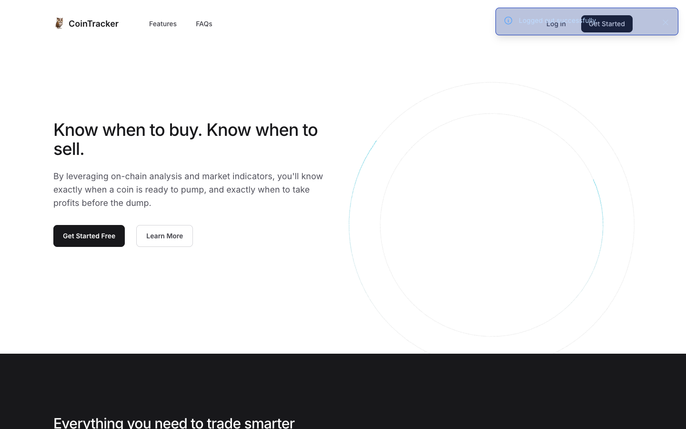

### Registering an account

Click **Get Started** to reach the registration page. CoinTracker uses
**passwordless authentication** — you only need to provide an email address.
After clicking **Create an account**, a confirmation email is sent.

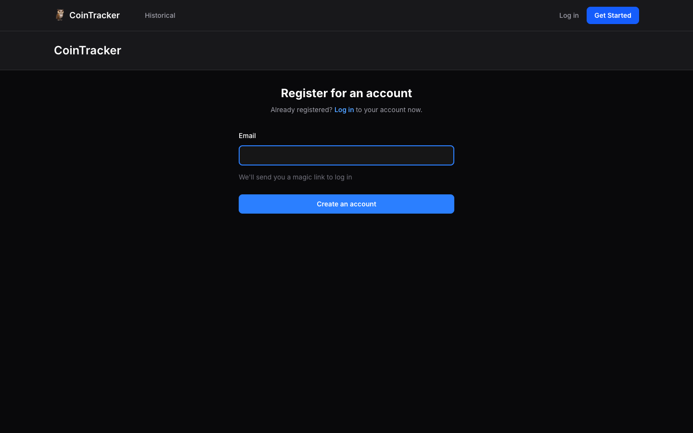

### Confirming via magic link

Instead of a password, you log in with a magic link sent to your email. In
development, emails land in the **dev mailbox** at
`http://localhost:4000/dev/mailbox`. Open the confirmation email and click the
link inside.

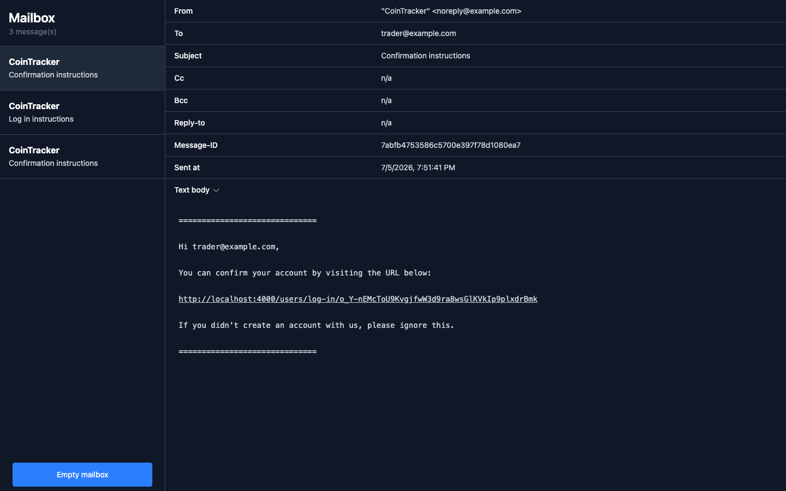

The link takes you to a confirmation page. Click **Confirm and stay logged in**
to complete registration.

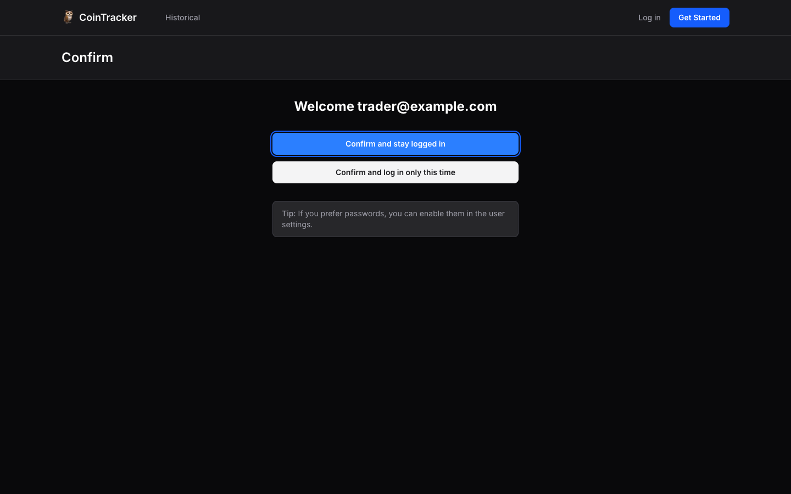

### Logging in

After registration, you can log in anytime from the **Log in** page. Enter your
email and click **Log in with email** to receive a new magic link, or use the
password fields if you've set a password in Settings.

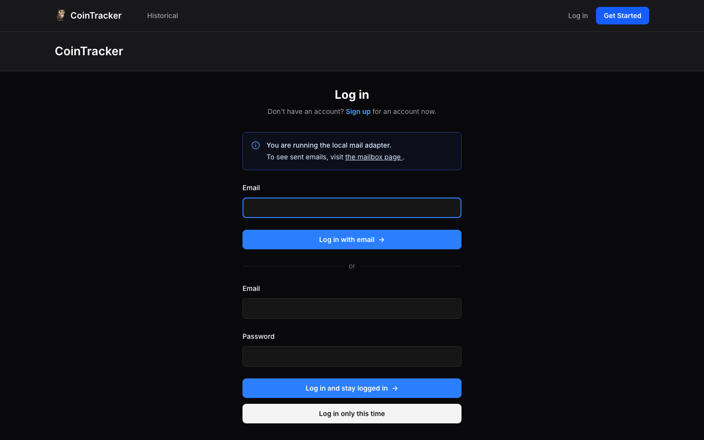

---

## 2. The Free Tier

After registering, you start on the **free** tier. The app redirects you to the
**pricing page** at `/upgrade`, where you can see the Pro plan features.

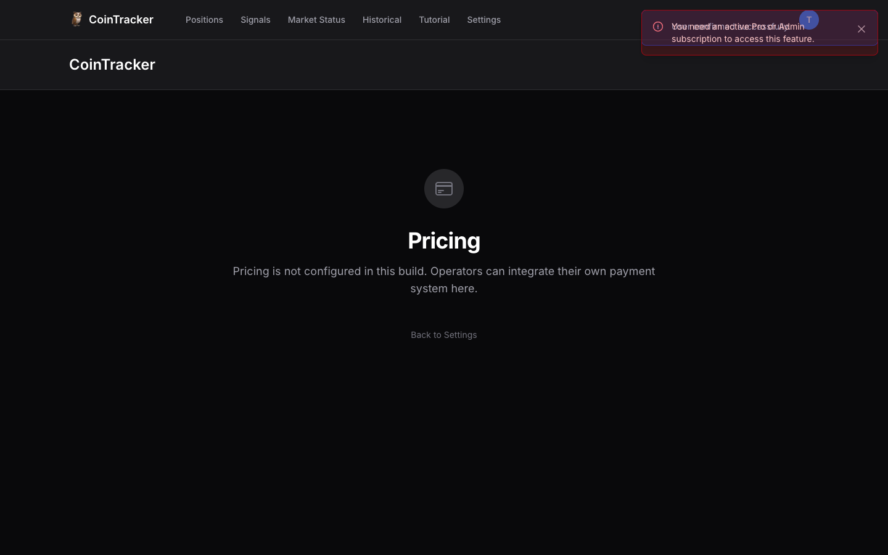

### What you can access for free

| Feature | Available on free? |
|---------|--------------------|
| Position tracking (create, edit, close) | Yes |
| Historical signals (limited to >7 days after exit) | Yes |
| Tutorial | Yes |
| Account settings | Yes |
| Exchange API key management | Yes |
| **Signals (real-time Top 10)** | **Pro only** |
| **Market status** | **Pro only** |

### Historical Signals (free view)

The **Historical** page at `/historical` shows every symbol that has appeared
in the top 10. On the free tier, you see only signals that exited the top 10
**more than 7 days ago** — recent data is Pro-only.

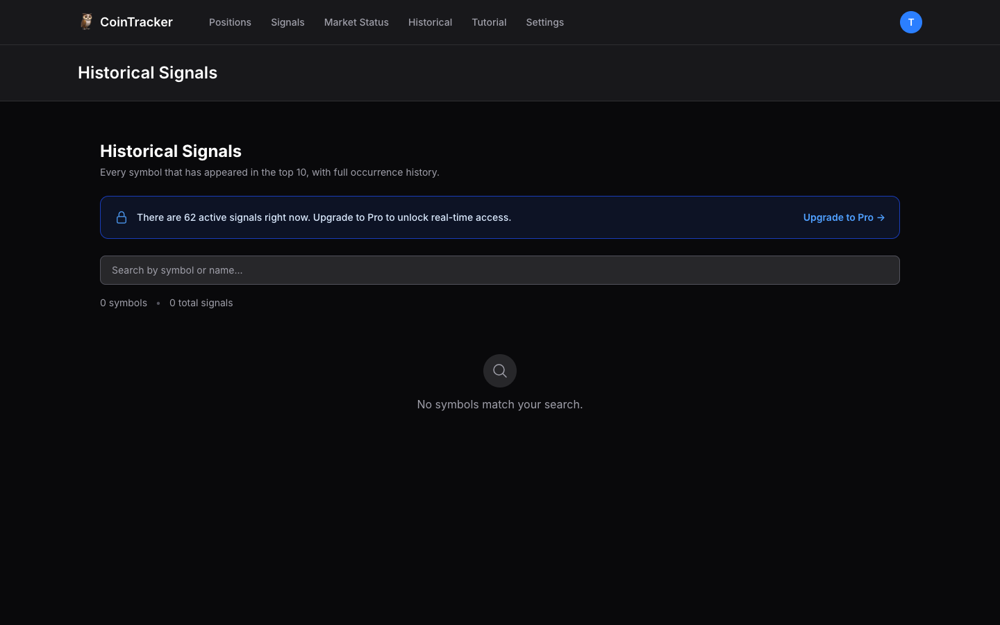

> **Note:** with fresh data, the free historical page may appear empty because
> all signals are either still active or exited less than 7 days ago. Once
> you're on Pro, all 60+ symbols appear immediately.

### Tutorial

The **Tutorial** page at `/tutorial` walks you through the full workflow:
evaluating signals, buying on your exchange, creating a position, and
connecting Telegram.

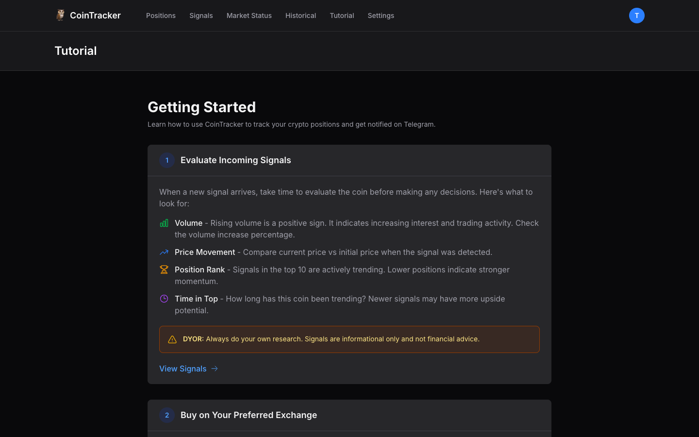

---

## 3. Pro Features

Once your account is upgraded to Pro (see [Admin Panel](#7-admin-panel-for-operators)
or ask your instance operator), you get access to the two headline features.

### Signals

The **Signals** page at `/signals` is the core of CoinTracker. It shows the
current **Top 10 Performers** — coins that CoinScanX has identified as showing
bullish on-chain activity — along with a **Grace Period** section for coins that
recently dropped out of the top 10.

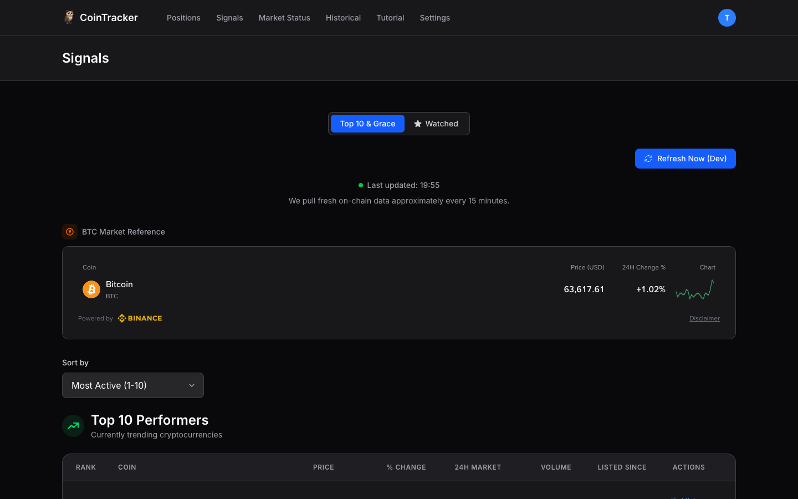

Each signal card shows:

- **Symbol** (links to CoinMarketCap for external research)
- **History** (links to the internal historical page for that symbol)
- **Watch** button (adds the coin to your Watched tab for quick access)
- A live price ticker at the top (powered by Binance) with 24h change and a
  sparkline chart

The **Watched** tab shows only the coins you've watched. Use it to keep an eye
on specific signals without scrolling through the full list.

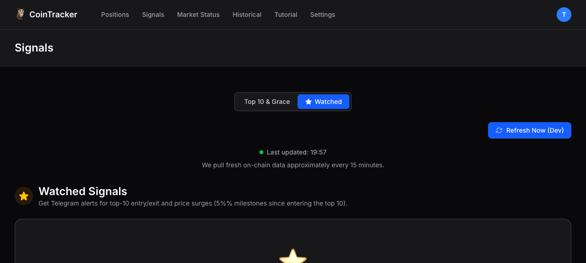

### Signal detail page

Click any signal to see its **detail page** at `/signals/:id`. This shows
performance metrics (initial price, current price, max price, max increase %),
a price chart, 24h volume, top-10 position history, and previous occurrences of
the same symbol.

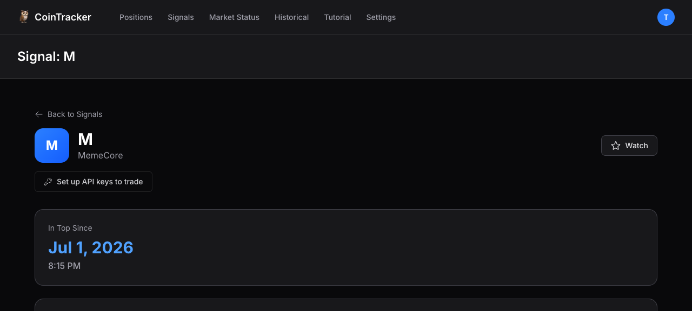

### Trade from a signal

The **Trade** page at `/signals/:id/trade` lets you act on a signal directly.
If you've stored your Binance API keys (see [Exchange API Keys](#exchange-api-keys)),
you can place an order from this page. Otherwise, it prompts you to set up API
keys first.

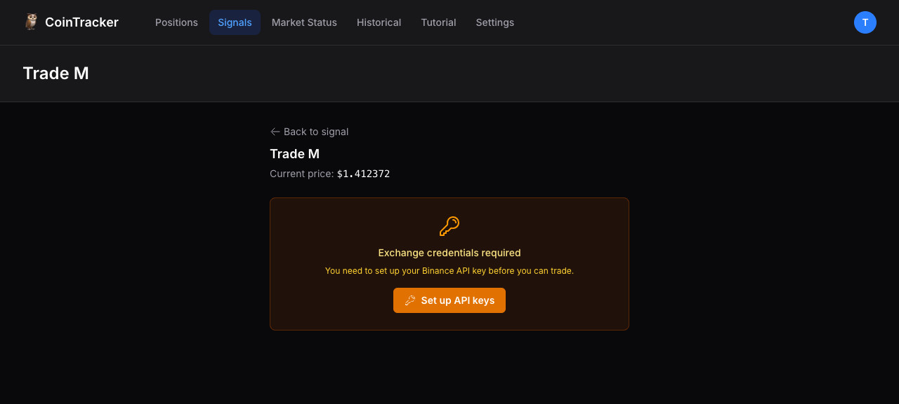

### Market Status

The **Market Status** page at `/market-status` shows whether the market is
currently bullish, bearish, or ranging, based on the number of active signals.
A historical trend chart lets you toggle between 24h, 7-day, and 30-day views
to time your strategy.

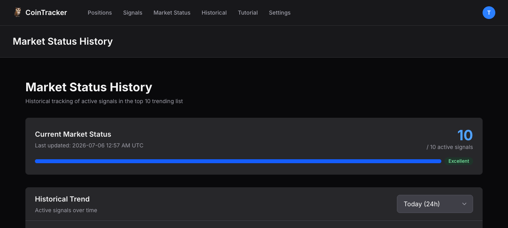

### Historical Signals (Pro view)

With Pro, the Historical page populates with all symbols — including active
ones. You can filter by All / Active / Inactive / Recently Exited, and search
by symbol or name.

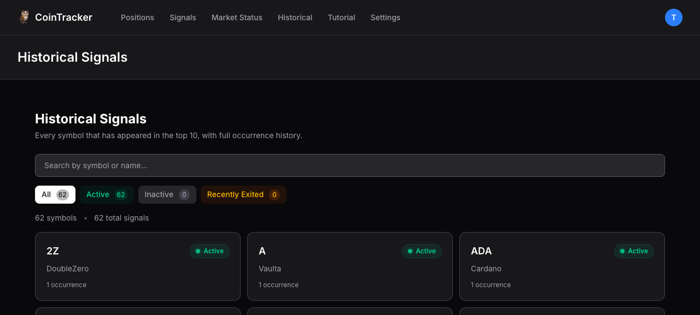

Click any symbol to see its full occurrence history:

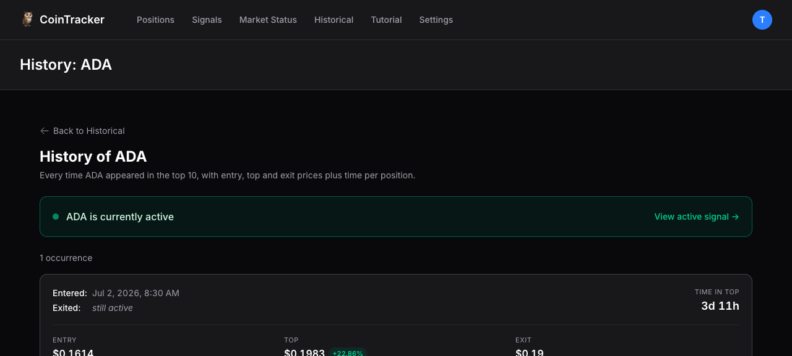

---

## 4. Managing Positions

### Creating a position

Navigate to **Positions** → **+ Add Position** (or `/positions/new`) to log a
trade. Fill in:

| Field | Description |
|-------|-------------|
| **Symbol** | The trading pair symbol (e.g. `BTC`, `ETH`, `SOL`) |
| **Exchange** | Binance Spot, Bitget Spot, or MEXC Spot |
| **Entry Price** | Your buy price |
| **Alert Every %** | How often to receive Telegram price alerts (default: 2%) |
| **Stop Loss %** | Automatic alert when price drops this far below entry |
| **Take Profit %** | Automatic alert when price rises this far above entry |
| **Amount Invested** | Optional — how much capital you put in |

The form shows a live **Order Preview** with calculated take-profit and
stop-loss prices as you type.

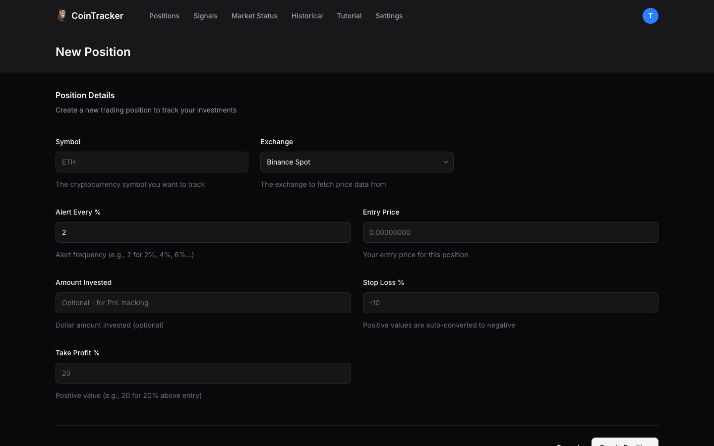

### Viewing your positions

The **Positions** page at `/positions` lists all open positions, sorted by
profitability by default. Each position card shows:

- Symbol and exchange
- Current P&L percentage
- Progress toward your take-profit target
- Entry price vs. current price
- Time held
- Whether the coin is currently in the top 10

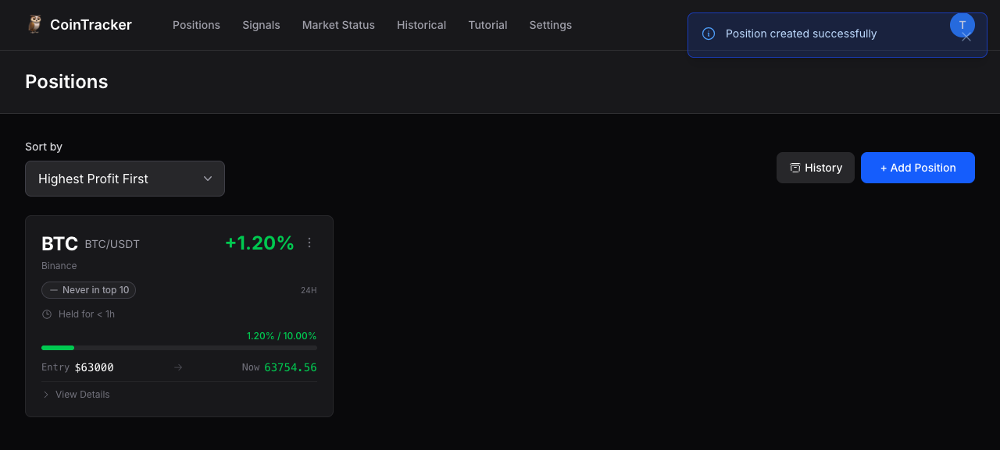

If you have no positions yet, you'll see an empty state with a **Create
Position** link.

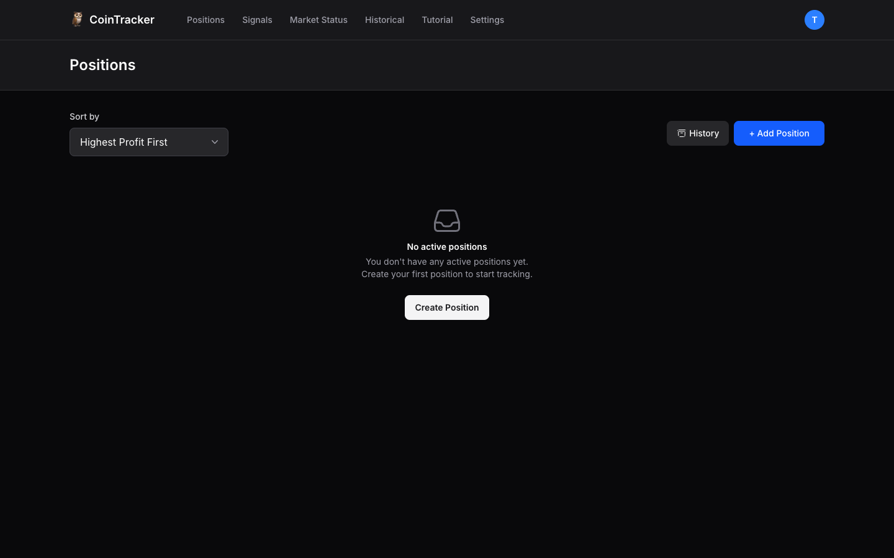

### Editing a position

Click the disclosure triangle on a position card to expand its actions, or
navigate to `/positions/:id/edit` to modify the entry price, alert thresholds,
or other fields.

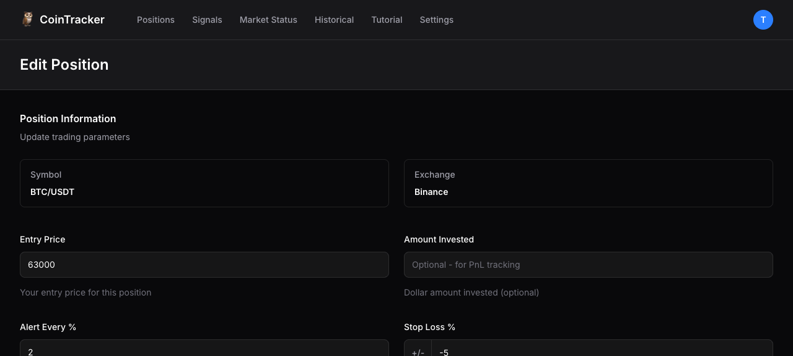

### Closed positions

The **History** tab at `/positions/closed` shows all positions you've closed,
with final P&L. This is your trading journal.

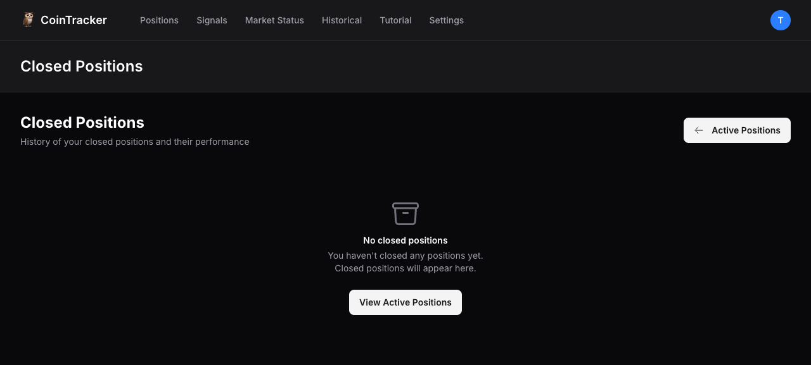

---

## 5. Telegram Alerts

CoinTracker sends Telegram notifications for:

- **New signals** — when a coin enters the top 10 with bullish activity
- **Position alerts** — when your positions hit the alert-every threshold,
  stop-loss, or take-profit levels
- **Market status changes** — when the market shifts between bullish/bearish

To connect Telegram:

1. Create a bot via [@BotFather](https://t.me/BotFather) on Telegram
2. Get your chat ID (message [@userinfobot](https://t.me/userinfobot))
3. Ask your instance operator to set `TELEGRAM_BOT_TOKEN` and your chat ID

Once connected, you'll receive real-time alerts on your phone whenever
something needs your attention. See `docs/telegram-alerts.md` for technical
details on how alerts are triggered.

---

## 6. Account Settings

### User settings

The **Settings** page at `/users/settings` lets you:

- View your subscription status (current plan, expiry date)
- Change your email address (requires confirmation via magic link)
- Set or change your password
- Switch between light/dark themes
- Change your language preference

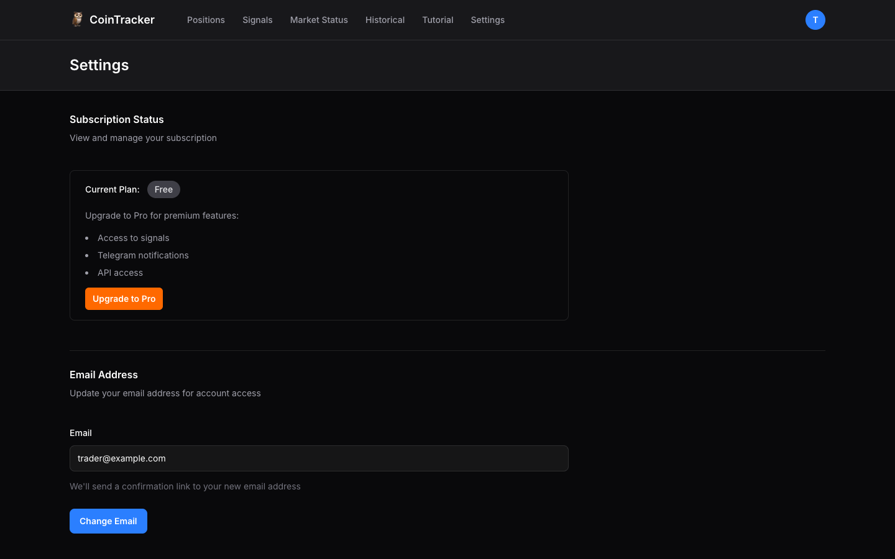

### Exchange API Keys

The **Exchange API Keys** page at `/settings/exchange-keys` lets you store
encrypted Binance API credentials so you can trade directly from signal pages.
API keys are encrypted at rest using [Cloak](https://github.com/danielberkompas/cloak).

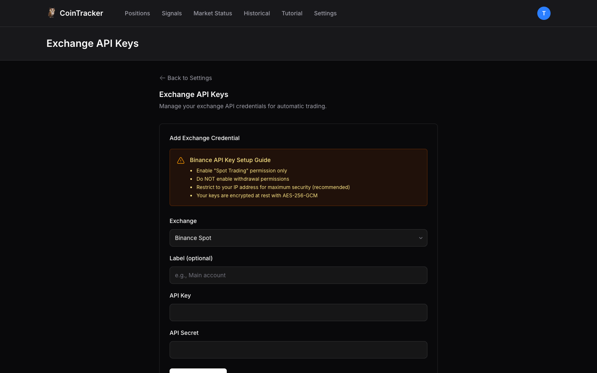

> **Security:** only store API keys with **read + trade** permissions. Never
> store keys with withdrawal permissions on any third-party service.

---

## 7. Admin Panel (for operators)

If your account has the **admin** tier, you'll see an **Admin** link in the
navigation. The admin panel is powered by [Backpex](https://backpex.live) and
provides full CRUD access to users, positions, and signals.

### Admin dashboard

The dashboard at `/admin` shows quick-action cards for each management area.

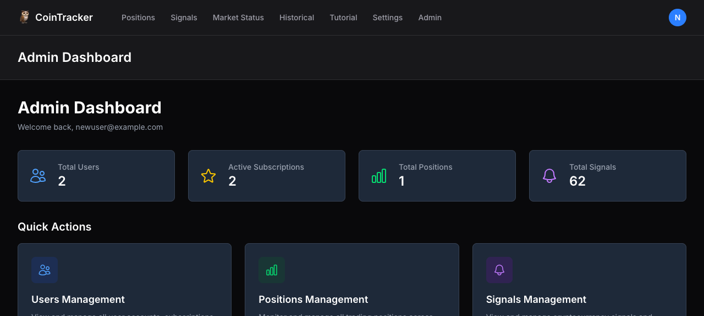

### User management

The **Users** panel at `/admin/users` lists all registered users with their
subscription tier, expiry, and account details.

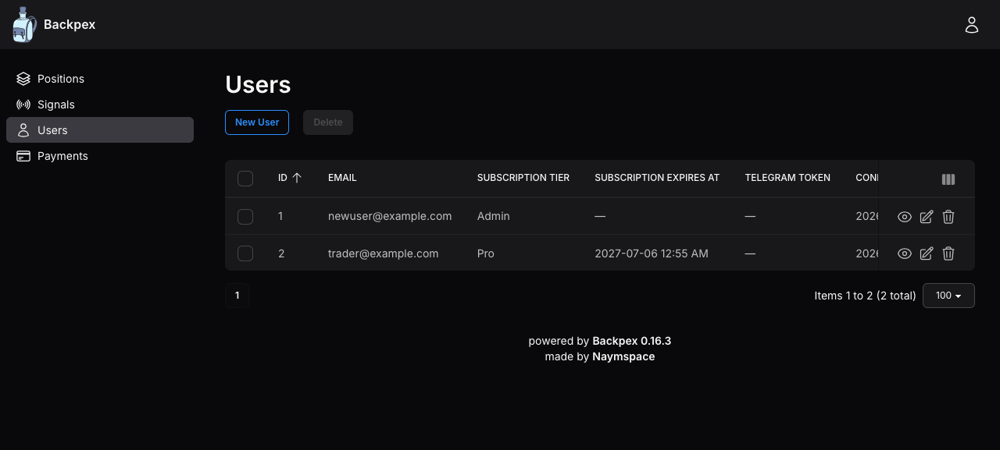

From the edit page (`/admin/users/:id/edit`), an admin can:

- Change a user's **Subscription Tier** (Free → Pro → Admin) using the dropdown
- Set the **Subscription Expires At** date
- View (but not edit) the user's Telegram token and confirmation status

This is how operators **grant Pro access** to users without a payment provider.

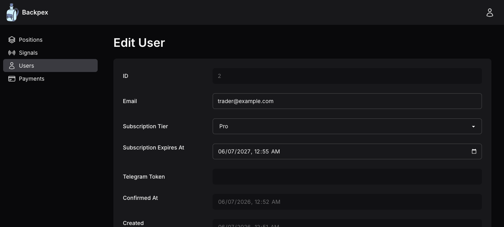

### Position management

The **Positions** panel at `/admin/positions` shows all positions across all
users, with the ability to view, edit, or delete any position.

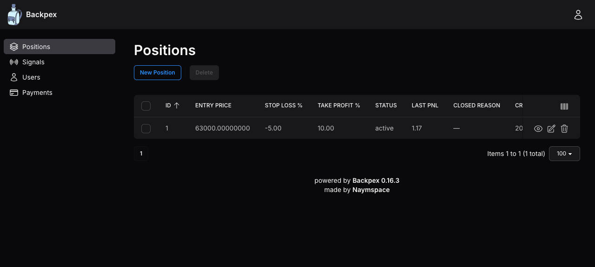

### Signal management

The **Signals** panel at `/admin/signals` shows all ingested signals with
full detail (initial price, price after 7d/14d, max price, max increase %,
volume, active/inactive status). Admins can search, filter, and edit signals
directly.

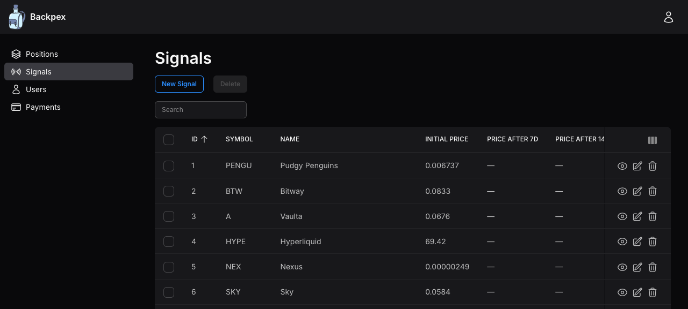

### Payments

The **Payments** page at `/admin/payments` currently shows a "Not Configured"
placeholder. The original USDT TRC-20 payment system was removed for the public
release. Fork operators can wire their own payment provider and use this area
to manage subscriptions.

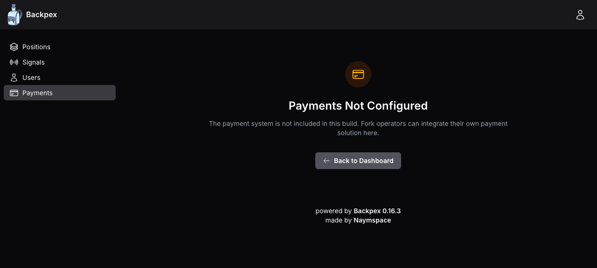

---

## Quick reference: route access

| Route | Free | Pro | Admin |
|-------|------|-----|-------|
| `/` (landing) | Public | Public | Public |
| `/historical` | Limited (>7d delay) | Full | Full |
| `/positions` | Yes | Yes | Yes |
| `/tutorial` | Yes | Yes | Yes |
| `/users/settings` | Yes | Yes | Yes |
| `/settings/exchange-keys` | Yes | Yes | Yes |
| `/upgrade` | Pricing page | Status page | Status page |
| `/signals` | Redirects to `/upgrade` | Yes | Yes |
| `/market-status` | Redirects to `/upgrade` | Yes | Yes |
| `/admin/*` | Redirects to `/upgrade` | Redirects to `/upgrade` | Yes |
